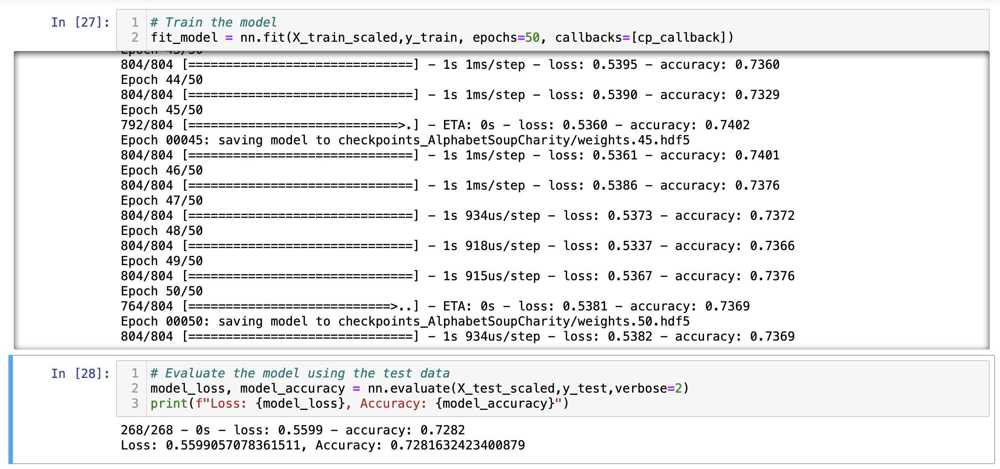
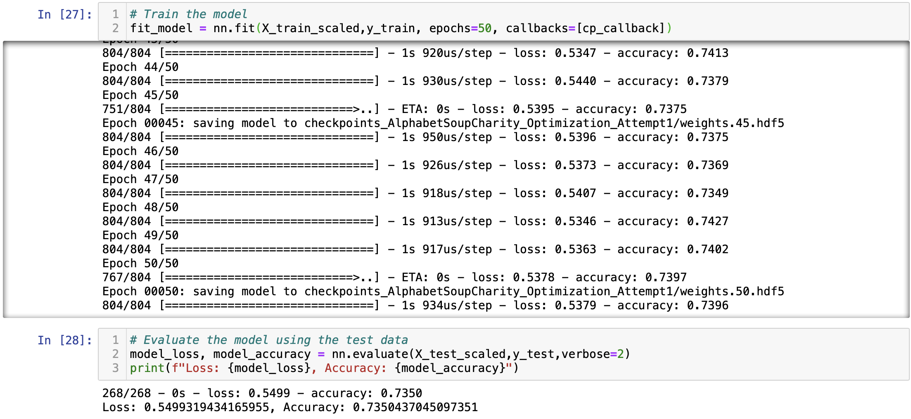
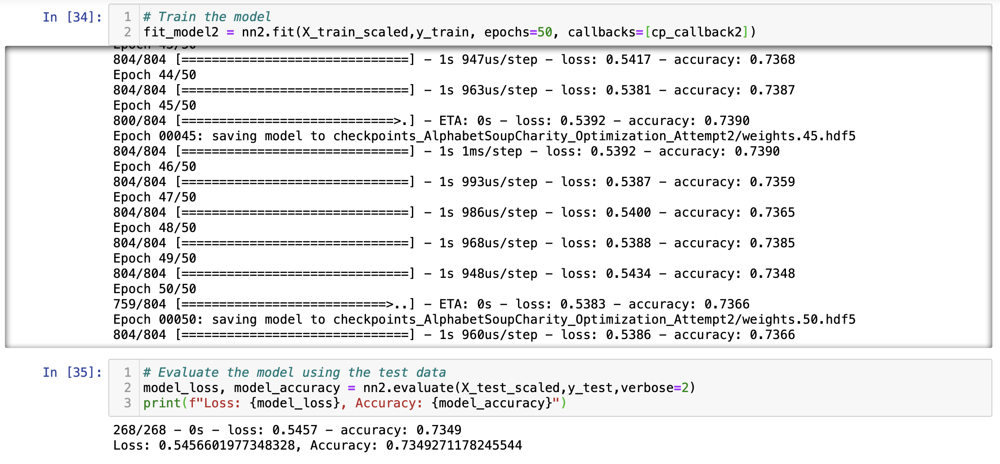
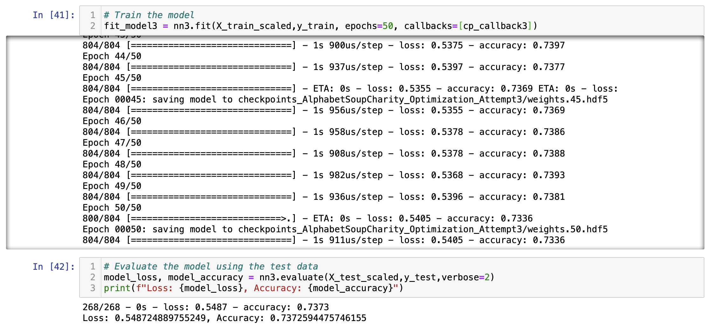
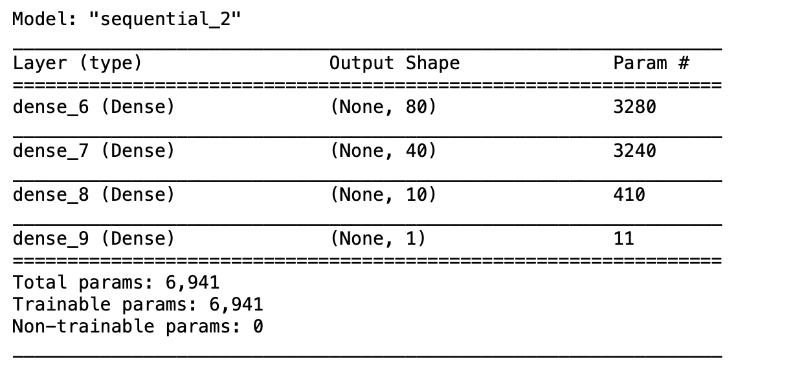
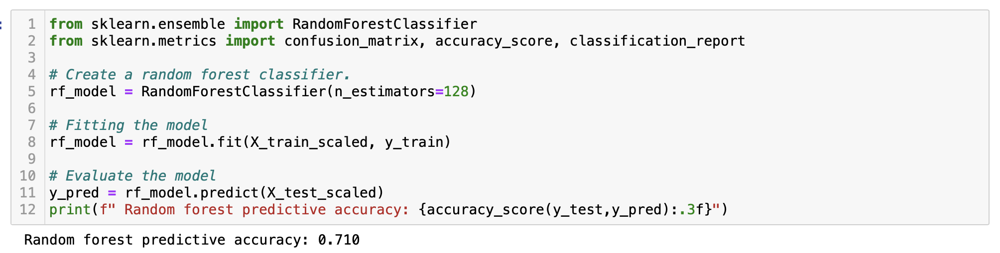

# Challenge-19

# Neural Networks 

# Overview of the Analysis

The study analyzed a dataset of 34,299 charities that have received funding from a large philantropic organization over the years. Using the metadata of each charity, a deep neural network model was built in order to determine whether or not the charity was successful in effectively using the money it received. After building the initial model, several attempts were made to maximize its prediction accuracy beyond a specific threshold.

The results of the study aims to help the philantropic organization screen potential recepients of its donations based on a particular set of fetaures. This will minimize the overall risk of the organization since they can better allocate their donations to charities who will most likely use it successfully. 

# Results

Data Preprocessing
- The IS_SUCCESSFUL column of the dataset was used as the target of the model. It indicates whether or not a charity succeeded in effectively using the money it received. 
- The following columns from the data set were used as the features of the model prior to model optimization: AFFILIATION (Affiliated sector of industry), CLASSIFICATION (Government organization classification), USE_CASE (Use case for funding), ORGANIZATION (Organization type), INCOME_AMT (Income classification), ASK_AMT(Funding amount requested), STATUS (Active status) and SPECIAL_CONSIDERATIONS (Special consideration for application).
- As identifier columns, both the EIN and NAME columns of the data set were not used since they were neither target nor features of the pre and post optimized model. In the optimized versions of the model, all features were retained except for EIN, NAME, STATUS (Active status) and SPECIAL_CONSIDERATIONS (Special consideration for application).  

    <strong>Original Model </strong>  
    

    <strong> Model after Optimization Attempt 1</strong>  
    

    <strong> Model after Optimization Attempt 2</strong>  
    

    <strong> Model after Optimization Attempt 3</strong>  
    

Compiling, Training, and Evaluating the Model
- Prior to the optimization attempts, 2 hidden layers were originally used in order to create a deep neural network. The first hidden layer had 80 neurons, while the second hidden layer had 30 neurons. This was chosen so that the total neurons in the model would fall between 2 and 3 times the number of features (40 features) used as inputs. The relu activation function was used for both hidden layers in order for their output values to range from 0 to infinity.  Since the model aimed to predict a binary outcome (successful or not successful),  the sigmoid activation function which converts output values as either 0 or 1 was used for the output layer. 
- After several attempts of model optimization, the 75% model target performance was not achieved. 
- The following steps were taken in order to increase the model’s accuracy.
    - For all optimization attempts: In addition to the EIN and the NAME columns, the STATUS and SPECIAL_CONSIDERATION columns were dropped. The status which describes the activity/ inactivity of a charity does not indicate its ability to succeed in using donations effectively. Most of the charities in the data have an active status while the very few that do not, have a mix of successes and failures. It is possible that an inactive charity is a result of its failure to properly fund its programs due to the mismanagement of the donations it received. However, it is also possible for a charity to chose to close down after successfully funding a short term project or cause. Either way, the status of a charity is not indicative of its success. The same is true for whether or not a charity received  special considerations during its application for funding. Charities who were given such special consideration could have mismanaged funds just as easily as those who did not receive special consideration. Moreover, several other variables such as the income amount of the charity or the use cases for the funds bear more weight on its success.
    - For optimization attempt 1: The number of neurons in the second hidden layer of the two hidden layer neural net was increased from 30 neurons to 40 neurons. This was done incrementally in order for the model to process more information about the the data without overfitting it.  
    - For optimization attempt 2: The softmax activation function was used in the two hidden layers. This function is an alternative to the relu function especially when categorical classification is required. 
    - For optimization attempt 3: A third hidden layer with 10 neurons was also introduced to help the model take more information into account and analyze complex and non-linear relationships in the data set. 

# Summary

    <strong> Summary of Model after Optimization Attempt 3</strong>  
    

The optimized model resulting from attempt 3 is a deep neural network wherein the first, second and third hidden layers contained 80, 40, and 10 neurons respectively. All these layers utilized the relu activation function while the output layer which contained one neuron, used the sigmoid function. The model demonstrated an accuracy rate of 73.36% when fitted with the training data and a  73.73% accuracy rate when evaluated with the testing data. Overall, the model was correct almost three quarters of the time in predicting whether or not a charity succeeded in using the money it received. 

# Recommendation 

An alternative model that can be used to solve this classification problem is the random forest model. This supervised machine learning algorithm processes several subsets of the data on 
several weak learner algorithms or shallow decision trees. The final classification output of the model is based on a consensus of all the prediction results of the weak learners. This is a good alternative because it is a robust model that can withstand outliers and non linear data. Furthermore, it produces comparable results to the deep neural network model with relatively fewer lines of code. 

    <strong> Random Forest Model</strong>  
    

The predictive accuracy of the deep neural network and the random forest were close. Both models were able to correctly predict the success of a charity at least 70% of the time. Although the random forest model was 2-3 percentage points less accurate, it had a significantly faster performance relative to the deep neural network.  In fact, the random forest model trained on the same large dataset and made comparable predictions for a fraction of the time that the deep neural network did. 

